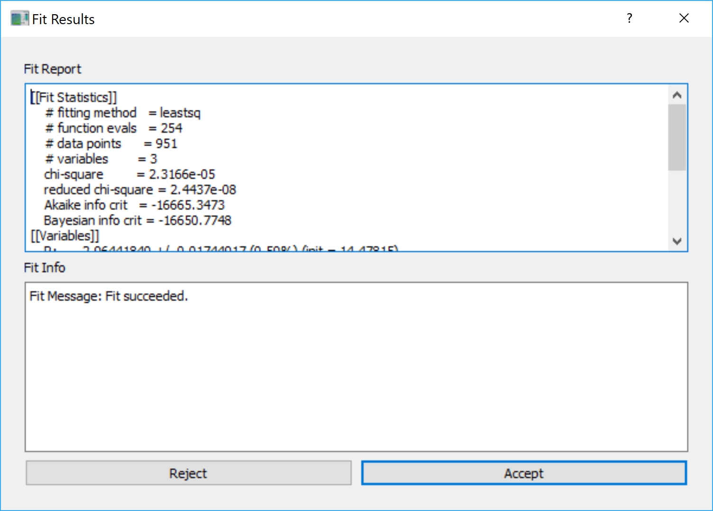

.. _Brief_Tutorial:

Brief Tutorial
==============
This tutorial is focused on showing a beginner how to use the **XModFit** to:

1. Simulate an already available function
2. Data Importing and Fitting
3. Write your own model/function using the :ref:`Function_Editor`

Simulate an already available function
--------------------------------------
The available functions can be simulated by following these steps:

1. Go to a **Function** tab
2. Select a categories among the **Function Categories** which will populate the **Functions** lists with functions/models available for that category.
3. Click on one of the functions which will create a plot the simulated curve in the **Data and Fit** tab and also it will populates the parameter tables in **Parameters** tab with the parameter values required for the functions.
4. The values of **X-axis** of the simulated curve can be changed by changing the **x** parameter located at the to of the **Parameters** tab.
5. All the parameters can be changed and on change of each of the parameters the function/model will be re-calculated and the plot will be updated.

Data Importing and Fitting
--------------------------
The main objective of **XModFit** is to provide a user to fit a model/function to a data. Please follow these to perform a data fitting using :ref:`XAnoS_Fit`:

1. Click the **Data** tab.
2. Import data file(s) by clicking the **Add Files** button which will prompt for selecting the data files.
3. Once imported the data files with their path will be listed in the **Data files** list below the **Add Files** button
4. Select the data file in the list which you would like to fit.
5. Go to **Functions** tab and select the necessary Category from the **Function Category** list and then select the necessary function from the **Functions** list.
6. Now you will have both data and simulated curve/function plotted as symbols and lines, respectively.
7. At this point play with the parameters value in the **Parameters** tab to make the simulated curve/function close to the data.
8. Once the simulated curve looks very close to the data you can select the parameters available in the **Single fitting parameters** and **Multiple fitting parameters** as fitting parameters by checking out the checkbox (☑) available in box carrying the parameter values.
9. Constraints on the **Single fitting parameters** can be implemented by adding values to the cell corresponding to **Min/Max** columns which are kept by default as **-inf/inf**, respectively, for no limits.
10. Constraints on the **Multiple fitting parameters** can be implemented by **double-clicking** the cell displaying the value of parameter of interest. This will open a dialog to chose for the **Min/Max** values for the parameters which are also kept as **-inf/inf**, respectively, for no constraints.
11. Go back to the **Data** tab and provide the **X-range** of the data in this format **Xmin:Xmax** to perform the fit. By default, the values of **Xmin:Xmax** is taken from the **Xmin** and **Xmax** of the data.
12. Select the **Fit Scale**  between the **Linear|Log** option. By default the **Linear** option is selected. **Fit Scale** determines how the **Chi-Square** (:math:`\chi^2`) will be calculated i.e.:

    * For **Fit Scale=Log**: :math:`\chi^2` is calculated using :math:`\log{(DataY)}-\log{(SimulatedY)}`
    * For **Fit Scale=Linear**: :math:`\chi^2` is calculated using :math:`DataY-SimulatedY`
13. Click the **Fit** button to start fitting the data which will open up a :ref:`Fit_Progress` dialog showing the number of iterations and the :math:`\chi^2` corresponding to the current iterations. The plot of the simulated data will also be updated with the parameters, corresponding to the iteration, as the fit progresses.
14. The iterations will continue until either the minimum :math:`\chi^2` is obtained or **maximum number of iterations (default=1000)**  are reached.
15. Once the fitting concluded a :ref:`Fit_Results` dialog will appear showing all the necessary details about the fitting.
16. At this point the user has freedom to either **Accept/Reject** the fitting results.

    * **Accepting** will update all the fitting parameters with the :math:`\chi^2`-minimized parameters
    * **Rejecting** will keep the parameters unaltered with the values before starting the fit.

.. _Fit_Progress:

.. figure:: ./Figures/Fit_Progress.png
    :figwidth: 30%

    Fit Progress Dialog

.. _Fit_Results:

    Fit Results Dialog
